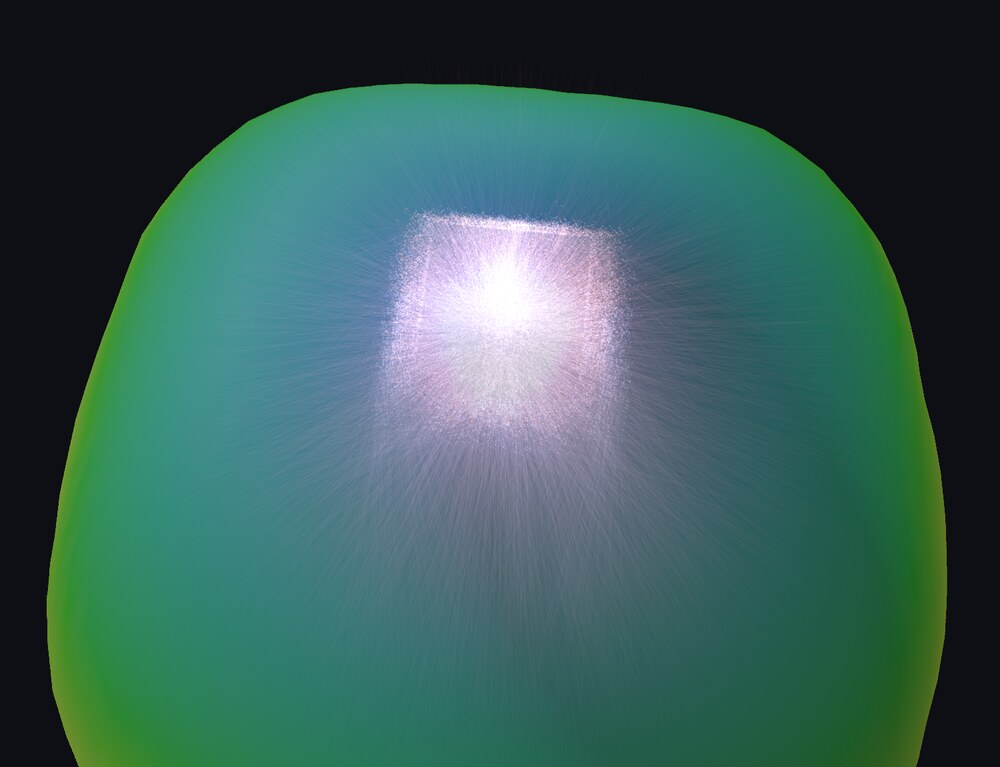

# tm25ray

Rust reader, writer and far-field converter for **IES TM-25** ray files
(`.TM25RAY`) — the vendor-neutral format for the near-field emission of LEDs
and other light sources.

A TM-25 file describes a source as individual rays: start point (mm), unit
direction, flux, optionally wavelength, polarisation and colour data. It is
what LED makers publish for optics design (ams OSRAM ships packages with
100k to 20M rays) and what Zemax OpticStudio, LightTools, SPEOS and the like
consume. This crate reads and writes those files without pulling in anything
else: no dependencies beyond `thiserror`, `std`-only, runs unchanged on
`wasm32`, and streams multi-GB files without loading them.

```toml
[dependencies]
tm25ray = "0.1"
```

**[Open a ray file in your browser](https://iesna.eu/?wasm=tm25)** — no install,
nothing uploaded, WebGPU required. More at
**[holg.github.io/tm25ray](https://holg.github.io/tm25ray/)**.

[](https://iesna.eu/?wasm=tm25)

## What you get

- **Zero-copy reader** — `Tm25File::parse(&bytes)` parses the header and
  exposes the ray block as a view, no per-ray allocation.
- **Streaming reader** — `Tm25Reader::new(any_read)` yields rays in chunks; the
  20M-ray / 560 MB vendor file decodes at ~91 M rays/s (see [Performance](#performance)).
  In the browser, feed it `Blob.slice` chunks.
- **All record layouts** — the column set follows the file's known-data
  flags: radiant / luminous flux, per-ray wavelength, Stokes and polarisation
  ellipse, tristimulus, spectrum index, user-defined items. Not just the
  28-byte case.
- **Real vendor files, not just one** — ams OSRAM and Lumileds disagree about
  whether the optional column-name trailer exists and about the byte order of
  the "unknown value" sentinel. Both are handled, and a parse/write round trip
  reproduces either byte for byte. See
  [Vendor differences](docs/format.md#vendor-differences-confirmed-on-real-files).
- **Writer** — `write_tm25(...)` produces files that round-trip byte-for-byte
  on the header; use it to export subsets or synthetic sources.
- **Flux-preserving subsampling** — `subsample` (Floyd) and a streaming
  `Reservoir`; the kept rays are rescaled so their flux still sums to the
  file total. Deterministic per seed, built-in PRNG.
- **Far field** — `FarField::from_rays(...)` bins directions into a C/γ grid
  with solid-angle normalisation (W/sr or cd), gives the azimuthal profile,
  half-intensity angle, forward fraction, bilinear sampling and a
  Monte-Carlo-aware smoother.
- **Coordinate helpers** — `direction_to_c_gamma` (EULUMDAT/IES angles) and
  `to_bevy` / `from_bevy` for y-up engines.
- **Validation** — the consistency rules of the reference implementation
  (flag combinations, positive wavelengths, non-negative weights), strict by
  default, lenient on request. No panics on untrusted input.

## Quick start

```rust
use tm25ray::{FarField, FluxKind, Tm25File};

let bytes = std::fs::read("rayfile_100k.TM25RAY")?;
let file = Tm25File::parse(&bytes)?;
let h = &file.header;
println!("{} rays, {:?}, {} W, spectrum {:?}",
    h.n_rays, h.flux_kind(), h.radiant_flux_w, h.spectral_id);

// Every ray, decoded on the fly.
let peak_dir = file.rays.iter().map(|r| r.kz).fold(f32::MIN, f32::max);

// Far field: 10° C planes, 5° γ rings.
let rays: Vec<_> = file.rays.iter().collect();
let ff = FarField::from_rays(&rays, 10.0, 5.0, FluxKind::Radiometric);
println!("half intensity at {:?}°", ff.half_intensity_gamma());
# Ok::<(), Box<dyn std::error::Error>>(())
```

Streaming a large file with a reservoir of 200k rays:

```rust
use std::io::BufReader;
use tm25ray::{Reservoir, Tm25Reader};

let file = std::fs::File::open("rayfile_20M.TM25RAY")?;
let mut reader = Tm25Reader::new(BufReader::with_capacity(1 << 20, file))?;
let mut keep = Reservoir::new(200_000, 1);
loop {
    let chunk = reader.read_chunk(65_536)?;
    if chunk.is_empty() { break; }
    keep.extend(chunk);
}
let rays = keep.finish(); // flux rescaled to the file total
# Ok::<(), Box<dyn std::error::Error>>(())
```

## The format

TM-25-13 (IES TM-25-13, revised as ANSI/IES TM-25-20) is a little-endian
binary file: a 36 288-byte fixed header (magic `TM25`, version, creation
method, luminous and radiant flux, u64 ray count, date, spectral identifier,
wavelength range, table and item counts, known-data flags, nine UTF-32
description strings), then spectral tables, column names and additional
text, then the ray records as `f32` columns.

The layout was reverse-engineered from real vendor files and cross-checked
field by field against the field names of the C++ reference implementation
(which carry the specification's section numbers). The standard text is
paywalled; the few details only it can settle are marked `VERIFY` in the code
and listed in [`docs/format.md`](docs/format.md).

## Examples

```bash
cargo run --release --example tm25_info -- file.TM25RAY   # header, spectrum, far-field profile, throughput
cargo run --release --example tm25_grid -- file.TM25RAY   # the binned C/γ grid as a table
cargo run --release --example tm25_bench -- file.TM25RAY  # timings per stage (see Performance)
cargo run --release --example tm25_sample -- out.TM25RAY   # write a synthetic file to open
cargo run --release --example tm25_roundtrip -- file.TM25RAY # header parses and re-writes byte for byte
```

## Performance

Apple M2 Max, `--release`, warm page cache, 28-byte records (position,
direction, radiant flux). `cargo run --release --example tm25_bench -- file.TM25RAY`.

| Stage                                   | 20M rays / 560 MB | throughput      |
| --------------------------------------- | ----------------- | --------------- |
| header only                             | 0.4 ms            | —               |
| stream + decode every ray                | 0.22 s            | 91 M rays/s     |
| `mmap` + decode every ray               | 0.21 s            | 96 M rays/s     |
| + reservoir, 200k flux-rescaled rays     | 0.33 s            | 61 M rays/s     |
| + far field, 10°/5° C/γ grid             | 0.95 s            | 21 M rays/s     |
| far field + reservoir (the viewer's job) | 1.08 s            | 19 M rays/s     |

Throughput is flat from 100k to 20M rays, so the smaller vendor files are
effectively instant: the 2.8 MB / 100k-ray file runs the whole viewer pipeline
in 6 ms. The far-field stage dominates because it does a trig call and a
solid-angle-weighted bin write per ray; decoding is a bounds-checked
reinterpret of `f32` columns and runs at memory speed.

## A file to try

Vendor ray files may be used but not redistributed, so the repository carries a
generated one instead: a 1 mm chip under a 1.4 mm silicone dome, Snell
refraction at the dome surface, rim leakage, a phosphor-white spectrum and a
per-ray wavelength. It is a simulation and the header says so.

- [`docs/sample/sample_white_led_25k.TM25RAY`](docs/sample/sample_white_led_25k.TM25RAY) (0.8 MB)
- [`docs/sample/sample_white_led_100k.TM25RAY`](docs/sample/sample_white_led_100k.TM25RAY) (3.2 MB)

```bash
cargo run --release --example tm25_sample -- out.TM25RAY 250000
```

Real measured files come from the manufacturers' product pages (ams OSRAM,
Lumileds, Nichia, Cree), which is what this crate was verified against.

## Tests

`cargo test` runs synthetic round-trips (written with the crate's own writer)
and, when a real vendor file is available, a regression test against it:
set `TM25RAY_FIXTURE=/path/to/rayfile_100k.TM25RAY`. Vendor files are not
redistributed; their licences allow use, not redistribution.

## Related

- [eulumdat-rs](https://github.com/holg/eulumdat-rs) — EULUMDAT/IES photometry,
  ATLA, spectral tools. Its `eulumdat-tm25` crate converts a `FarField` into an
  EULUMDAT document and attaches the header spectrum, and its Bevy viewer
  renders ray files in 3D.
- [TM25RaySetTools](https://github.com/JuliusMuschaweck/TM25RaySetTools) —
  the C++ reference implementation this crate was verified against.

## Licence

AGPL-3.0-or-later, like the rest of the eulumdat-rs family. If that does not
fit your product, get in touch.
